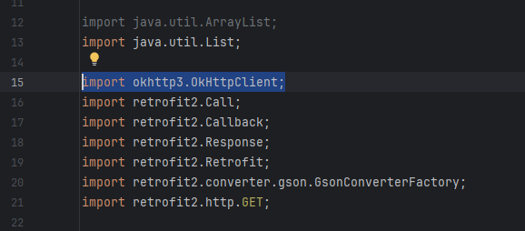

# Teaching 305 708 Flask API

This Flask API leverages the GradientAI service with the Llama model to generate educational quizzes on various topics.

## Prerequisites

- Python 3.x installed on your system.

## Installation

1. Clone the repository.
2. Navigate to the directory.
3. Setup a virtual environment and install dependencies:

### MacOS and Linux

    python -m venv pyEnv
    source pyEnv/bin/activate
    pip install -r requirements.txt
    python main.py

Use the following command to deacivate the Virtual Environment (when done):

```
deactivate
```

### Windows
    python -m venv pyEnv
    .\pyEnv\Scripts\activate
    pip install -r pip_install_commands.txt
    python main.py
  


Use the following command to deacivate the Virtual Environment (when done):

```
deactivate
```

## Running the API

Execute the `main.py` script:

```bash
python main.py
```

The server will start on the default port 5000.

## API Endpoints

The API has two primary routes:

### Home Route: /

This route returns a welcome message and confirms that the API is operational.

Example Request:

```js
curl http://localhost:5000/
```

Example Response:

```
Welcome to the Flask API!
```

### Get Quiz Route: /getQuiz

This route generates a quiz on a specified topic when provided with the topic as a query parameter. The API aims to return a set of three questions, each accompanied by multiple-choice options and the correct answer. Since Llama is a conversational AI model, there may be occasional discrepancies in its responses. If you encounter an empty quiz, please attempt to run the API again.

Example Request:

```js
curl http://localhost:5000/getQuiz?topic=Android%20Development
```

Example Response:

```json
{
    "quiz": [
        {
            "correct_answer": "C",
            "options": [
                "Android apps are designed for entertainment purposes only, while Android games are designed for both entertainment and productivity.",
                "Android apps are developed using Java, while Android games are developed using C++.",
                "Android apps are installed on the device's internal storage, while Android games are installed on the device's external storage.",
                "Android apps are designed for use on a single device, while Android games are designed for use on multiple devices."
            ],
            "question": "What is the main difference between a Android app and a Android game?"
        },
        {
            "correct_answer": "A",
            "options": [
                "A toolkit for developing Android apps that includes a set of pre-written code and tools for debugging and testing.",
                "A platform for developing Android games that includes a set of pre-written code and tools for debugging and testing.",
                "A tool for creating Android apps that are optimized for use on a single device.",
                "A tool for creating Android games that are optimized for use on a single device."
            ],
            "question": "What is the Android Software Development Kit (SDK)?"
        },
        {
            "correct_answer": "B",
            "options": [
                "An activity is a user interface that represents a single task or function, while a service is a background process that performs a specific task.",
                "An activity is a background process that performs a specific task, while a service is a user interface that represents a single task or function.",
                "An activity is a single instance of an app that runs on a single device, while a service is a single instance of an app that runs on multiple devices.",
                "An activity is a single instance of an app that runs on multiple devices, while a service is a single instance of an app that runs on a single device."
            ],
            "question": "What is the difference between a Android activity and a Android service?"
        }
    ]
}
```

Replace "Android Development" with your desired topic to generate questions related to that field. The response will be in JSON format, containing an array of questions, each with multiple-choice options and the correct answer.

# [IMPORTANT] Adapting your app in Android Studio to work on http environments 

### Step 1: Creating the `network_security_config` XML File

Create a file named `network_security_config.xml` in your application’s `res/xml` folder.

### Step 2: Add Configuration

Copy and paste the following configuration into your `network_security_config.xml` file:

```xml
<?xml version="1.0" encoding="utf-8"?>
<network-security-config>
    <domain-config cleartextTrafficPermitted="true">
        <domain includeSubdomains="true">10.0.2.2</domain>
    </domain-config>
</network-security-config>
```

### Step 3: Include in Manifest

Once you've added the `network_security_config.xml` file, you need to include it in your app's manifest file. Add the following line within the `<application>` element `android:networkSecurityConfig="@xml/network_security_config"`

#### Locate Your Manifest File
You can find your app's manifest file (AndroidManifest.xml) in the `app/manifests/` directory of your Android project.


Your final `AndroidManifest.xml` file should look like this 

```xml
<?xml version="1.0" encoding="utf-8"?>
<manifest xmlns:android="http://schemas.android.com/apk/res/android"
    xmlns:tools="http://schemas.android.com/tools">

    <uses-permission android:name="android.permission.INTERNET" /> 
    <uses-permission android:name="android.permission.ACCESS_NETWORK_STATE" />

    <application
        android:allowBackup="true"
        android:dataExtractionRules="@xml/data_extraction_rules"
        android:fullBackupContent="@xml/backup_rules"
        android:icon="@mipmap/ic_launcher"
        android:label="@string/app_name"
        android:roundIcon="@mipmap/ic_launcher_round"
        android:supportsRtl="true"
        android:theme="@style/Theme.HelpHub"
        tools:targetApi="31"
        android:networkSecurityConfig="@xml/network_security_config"
        >
        <activity
            android:name=".MainActivity"
            android:exported="true">
            <intent-filter>
                <action android:name="android.intent.action.MAIN" />
                <category android:name="android.intent.category.LAUNCHER" />
            </intent-filter>
        </activity>
    </application>
</manifest>
```

This will enable you to use `http` requests within your Android app. 

## [IMPORTANT]

Use the following <strong>baseURL</strong> for retrofit `http://10.0.2.2:5000/`

Your retrofit instance then should look like this 

```java
   Retrofit retrofit = new Retrofit.Builder()
        .baseUrl("http://10.0.2.2:5000/")
        .addConverterFactory(GsonConverterFactory.create())
        .client(new OkHttpClient.Builder().readTimeout(10, java.util.concurrent.TimeUnit.MINUTES).build()) // this will set the read timeout for 10mins (IMPORTANT: If not your request will exceed the default read timeout)
        .build();
```

_Note: Make sure you import `OkHttpClient`, in your imports it should add `import okhttp3.OkHttpClient;` line_


